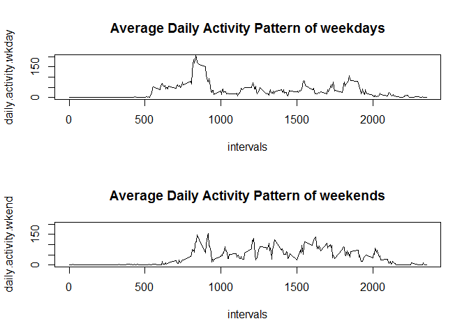

# Reproducible Research: Peer Assessment 1
      
## Loading and preprocessing the data 

```r
activity <- read.csv("activity.csv")
activity$date <- as.Date(activity$date)
summary(activity)
```

```
##      steps             date               interval     
##  Min.   :  0.00   Min.   :2012-10-01   Min.   :   0.0  
##  1st Qu.:  0.00   1st Qu.:2012-10-16   1st Qu.: 588.8  
##  Median :  0.00   Median :2012-10-31   Median :1177.5  
##  Mean   : 37.38   Mean   :2012-10-31   Mean   :1177.5  
##  3rd Qu.: 12.00   3rd Qu.:2012-11-15   3rd Qu.:1766.2  
##  Max.   :806.00   Max.   :2012-11-30   Max.   :2355.0  
##  NA's   :2304
```

```r
attach(activity)
```


## What is mean total number of steps taken per day? 


###1. Calculate the total number of steps taken per day

```r
steps.perday <- sapply(split(activity, date), function(a) sum(a$steps,na.rm=T) )
steps.perday
```

```
## 2012-10-01 2012-10-02 2012-10-03 2012-10-04 2012-10-05 2012-10-06 
##          0        126      11352      12116      13294      15420 
## 2012-10-07 2012-10-08 2012-10-09 2012-10-10 2012-10-11 2012-10-12 
##      11015          0      12811       9900      10304      17382 
## 2012-10-13 2012-10-14 2012-10-15 2012-10-16 2012-10-17 2012-10-18 
##      12426      15098      10139      15084      13452      10056 
## 2012-10-19 2012-10-20 2012-10-21 2012-10-22 2012-10-23 2012-10-24 
##      11829      10395       8821      13460       8918       8355 
## 2012-10-25 2012-10-26 2012-10-27 2012-10-28 2012-10-29 2012-10-30 
##       2492       6778      10119      11458       5018       9819 
## 2012-10-31 2012-11-01 2012-11-02 2012-11-03 2012-11-04 2012-11-05 
##      15414          0      10600      10571          0      10439 
## 2012-11-06 2012-11-07 2012-11-08 2012-11-09 2012-11-10 2012-11-11 
##       8334      12883       3219          0          0      12608 
## 2012-11-12 2012-11-13 2012-11-14 2012-11-15 2012-11-16 2012-11-17 
##      10765       7336          0         41       5441      14339 
## 2012-11-18 2012-11-19 2012-11-20 2012-11-21 2012-11-22 2012-11-23 
##      15110       8841       4472      12787      20427      21194 
## 2012-11-24 2012-11-25 2012-11-26 2012-11-27 2012-11-28 2012-11-29 
##      14478      11834      11162      13646      10183       7047 
## 2012-11-30 
##          0
```

###2. Make a histogram of the total number of steps taken each day

```r
hist(steps.perday, xlab="steps", breaks=10,
     main="Histogram of the total number of steps per day")
```

 

###3. Calculate and report the mean and median of the total number of steps taken per day

```r
mean(steps.perday)
```

```
## [1] 9354.23
```

```r
median(steps.perday)
```

```
## [1] 10395
```


## What is the average daily activity pattern?

###1. Make a time series plot of the 5-minute interval (x-axis) and the average number of steps taken, averaged across all days (y-axis)

```r
daily.activity <- sapply(split(activity, interval), function(a) mean(a$steps,na.rm=T) )
plot(names(daily.activity), daily.activity, type="l", 
     xlab="clock", main="Average Daily Activity Pattern")
```

 

###2. Which 5-minute interval, on average across all the days in the dataset, contains the maximum number of steps?

```r
names(sort(-daily.activity))[1]
```

```
## [1] "835"
```
The 5-minute interval which contains the maximum number of average steps is 8:35.


## Imputing missing values

###1. Calculate and report the total number of missing values in the dataset (i.e. the total number of rows with NAs)

```r
good <- complete.cases(activity)
nrow(activity)-nrow( activity[good,] )
```

```
## [1] 2304
```

```r
sum(is.na(steps))    # Double Check
```

```
## [1] 2304
```
The total number of missing values in the dataset is 2304.

###2. Devise a strategy for filling in all of the missing values in the dataset. Here I use the median for that interval.

```r
imp <- sapply(split(activity, interval), function(a) median(a$steps,na.rm=T) )
imp
```

```
##    0    5   10   15   20   25   30   35   40   45   50   55  100  105  110 
##    0    0    0    0    0    0    0    0    0    0    0    0    0    0    0 
##  115  120  125  130  135  140  145  150  155  200  205  210  215  220  225 
##    0    0    0    0    0    0    0    0    0    0    0    0    0    0    0 
##  230  235  240  245  250  255  300  305  310  315  320  325  330  335  340 
##    0    0    0    0    0    0    0    0    0    0    0    0    0    0    0 
##  345  350  355  400  405  410  415  420  425  430  435  440  445  450  455 
##    0    0    0    0    0    0    0    0    0    0    0    0    0    0    0 
##  500  505  510  515  520  525  530  535  540  545  550  555  600  605  610 
##    0    0    0    0    0    0    0    0    0    0    0    0    0    0    0 
##  615  620  625  630  635  640  645  650  655  700  705  710  715  720  725 
##    0    0    0    0    0    0    0    8   13    7   13   14    0    0   12 
##  730  735  740  745  750  755  800  805  810  815  820  825  830  835  840 
##    0    0   15   19   19   28   41   25   32   13   45   33   37   19   51 
##  845  850  855  900  905  910  915  920  925  930  935  940  945  950  955 
##   60   16   43   20    8   31   15   16    0    0    0    0    0    0    0 
## 1000 1005 1010 1015 1020 1025 1030 1035 1040 1045 1050 1055 1100 1105 1110 
##    0    0    0    0    0    0    0    0    0    0    0    0    0    0    0 
## 1115 1120 1125 1130 1135 1140 1145 1150 1155 1200 1205 1210 1215 1220 1225 
##    0    0    0    0    0    0    0    0    0    0    0    6   10    0    0 
## 1230 1235 1240 1245 1250 1255 1300 1305 1310 1315 1320 1325 1330 1335 1340 
##    0    0    0    0    0    0    0    0    0    0    0    0    0    0    0 
## 1345 1350 1355 1400 1405 1410 1415 1420 1425 1430 1435 1440 1445 1450 1455 
##    0    0    0    0    0    0    0    0    0    0    0    0    0    0    0 
## 1500 1505 1510 1515 1520 1525 1530 1535 1540 1545 1550 1555 1600 1605 1610 
##    0    0    0    0    0    0    0    0    0    0    0    0    0    0    0 
## 1615 1620 1625 1630 1635 1640 1645 1650 1655 1700 1705 1710 1715 1720 1725 
##    0    0    0    0    0    0    0    0    0    0    0    0    7    7    0 
## 1730 1735 1740 1745 1750 1755 1800 1805 1810 1815 1820 1825 1830 1835 1840 
##    7    7   26    7    0   10   15   18   26   25   24    9   33   26   34 
## 1845 1850 1855 1900 1905 1910 1915 1920 1925 1930 1935 1940 1945 1950 1955 
##   42   33   30   33   30    8    8    7    0    0    0    0    0    0    0 
## 2000 2005 2010 2015 2020 2025 2030 2035 2040 2045 2050 2055 2100 2105 2110 
##    0    0    0    0    0    0    0    0    0    0    0    0    0    0    0 
## 2115 2120 2125 2130 2135 2140 2145 2150 2155 2200 2205 2210 2215 2220 2225 
##    0    0    0    0    0    0    0    0    0    0    0    0    0    0    0 
## 2230 2235 2240 2245 2250 2255 2300 2305 2310 2315 2320 2325 2330 2335 2340 
##    0    0    0    0    0    0    0    0    0    0    0    0    0    0    0 
## 2345 2350 2355 
##    0    0    0
```

###3. Create a new dataset that is equal to the original dataset but with the missing data filled in.

```r
activity.imp  <- activity
detach()
attach(activity.imp)
for (i in 1:nrow(activity.imp) )  {
      steps[is.na(steps)] <- imp[ as.character( interval[is.na(steps)] ) ]
}
activity.imp$steps <- steps
summary(activity.imp)
```

```
##      steps          date               interval     
##  Min.   :  0   Min.   :2012-10-01   Min.   :   0.0  
##  1st Qu.:  0   1st Qu.:2012-10-16   1st Qu.: 588.8  
##  Median :  0   Median :2012-10-31   Median :1177.5  
##  Mean   : 33   Mean   :2012-10-31   Mean   :1177.5  
##  3rd Qu.:  8   3rd Qu.:2012-11-15   3rd Qu.:1766.2  
##  Max.   :806   Max.   :2012-11-30   Max.   :2355.0
```
activity.imp is the new dataset with the missing data filled in.


###4. Make a histogram of the total number of steps taken each day and Calculate and report the mean and median total number of steps taken per day. Do these values differ from the estimates from the first part of the assignment? What is the impact of imputing missing data on the estimates of the total daily number of steps?

```r
steps.perday.imp <- sapply(split(activity.imp, date), function(a) sum(a$steps,na.rm=T) )
mean(steps.perday.imp)
```

```
## [1] 9503.869
```

```r
median(steps.perday.imp)
```

```
## [1] 10395
```

```r
summary(steps.perday)
```

```
##    Min. 1st Qu.  Median    Mean 3rd Qu.    Max. 
##       0    6778   10400    9354   12810   21190
```

```r
summary(steps.perday.imp)
```

```
##    Min. 1st Qu.  Median    Mean 3rd Qu.    Max. 
##      41    6778   10400    9504   12810   21190
```

```r
steps.perday.imp[!steps.perday==steps.perday.imp]
```

```
## 2012-10-01 2012-10-08 2012-11-01 2012-11-04 2012-11-09 2012-11-10 
##       1141       1141       1141       1141       1141       1141 
## 2012-11-14 2012-11-30 
##       1141       1141
```

```r
hist(steps.perday.imp, xlab="steps", breaks=10,
     main="Histogram of the total number of steps per day(after imputing NAs)" )
```

 

The mean of the total number of steps per day is slightly greater than the orginal one, while the median remains the same. The histogram of total number of steps per day remains the same as the original one. Imputing missing data have only a tiny impact on the estimates of the total daily number of steps, since only 8 days of NA values are imputed, and imputed values are very small, only influencing the lower tail of the distribution.


## Are there differences in activity patterns between weekdays and weekends?

###1. Create a new factor variable in the dataset with two levels - "weekday" and "weekend" indicating whether a given date is a weekday or weekend day.

```r
wkd <- weekdays(date)
for (i in 1:length(wkd) )  {
      if (wkd[i]=="Sunday" | wkd[i]=="Saturday")   wkd[i] <- "weekend"
      else   wkd[i] <- "weekday"
}
activity.imp$wkd <- as.factor(wkd)
summary(activity.imp)
```

```
##      steps          date               interval           wkd       
##  Min.   :  0   Min.   :2012-10-01   Min.   :   0.0   weekday:12960  
##  1st Qu.:  0   1st Qu.:2012-10-16   1st Qu.: 588.8   weekend: 4608  
##  Median :  0   Median :2012-10-31   Median :1177.5                  
##  Mean   : 33   Mean   :2012-10-31   Mean   :1177.5                  
##  3rd Qu.:  8   3rd Qu.:2012-11-15   3rd Qu.:1766.2                  
##  Max.   :806   Max.   :2012-11-30   Max.   :2355.0
```
Variable wkd indicates whether a given date is a weekday or weekend day.


###2. Make a panel plot containing a time series plot (i.e. type = "l") of the 5-minute interval (x-axis) and the average number of steps taken, averaged across all weekday days or weekend days (y-axis). See the README file in the GitHub repository to see an example of what this plot should look like using simulated data.

```r
activity.imp.wkday <- subset(activity.imp, wkd=="weekday")
activity.imp.wkend <- subset(activity.imp, wkd=="weekend")
str(activity.imp.wkday)
```

```
## 'data.frame':	12960 obs. of  4 variables:
##  $ steps   : int  0 0 0 0 0 0 0 0 0 0 ...
##  $ date    : Date, format: "2012-10-01" "2012-10-01" ...
##  $ interval: int  0 5 10 15 20 25 30 35 40 45 ...
##  $ wkd     : Factor w/ 2 levels "weekday","weekend": 1 1 1 1 1 1 1 1 1 1 ...
```

```r
str(activity.imp.wkend)
```

```
## 'data.frame':	4608 obs. of  4 variables:
##  $ steps   : int  0 0 0 0 0 0 0 0 0 0 ...
##  $ date    : Date, format: "2012-10-06" "2012-10-06" ...
##  $ interval: int  0 5 10 15 20 25 30 35 40 45 ...
##  $ wkd     : Factor w/ 2 levels "weekday","weekend": 2 2 2 2 2 2 2 2 2 2 ...
```

```r
daily.activity.wkday <- sapply(split(activity.imp.wkday, interval), function(a) mean(a$steps) )
```

```
## Warning in split.default(x = seq_len(nrow(x)), f = f, drop = drop, ...):
## data length is not a multiple of split variable
```

```r
daily.activity.wkend <- sapply(split(activity.imp.wkend, interval), function(a) mean(a$steps) )
```

```
## Warning in split.default(x = seq_len(nrow(x)), f = f, drop = drop, ...):
## data length is not a multiple of split variable
```

```r
par(mfrow = c(2, 1))
plot(names(daily.activity.wkday), daily.activity.wkday, type="l", ylim=c(0,200),
     xlab="clock", main="Average Daily Activity Pattern of weekdays")
plot(names(daily.activity.wkend), daily.activity.wkend, type="l", ylim=c(0,200),
     xlab="clock", main="Average Daily Activity Pattern of weekends")     
```

 

Above is the panel plot made by Base Plotting System.


```r
daily.activity.imp <- c(daily.activity.wkday,daily.activity.wkend)
daily.activity.interval <- rep(unique(activity$interval),2)
daily.activity.wkd  <- rep(c("weekday", "weekend" ), each=length(daily.activity.wkday))
library(lattice)
xyplot(daily.activity.imp~daily.activity.interval |daily.activity.wkd , type="l", 
       layout = c(1, 2), xlab="intervals", ylab="number of steps")
```

 

Above is the panel plot made by Lattice Plotting System.


